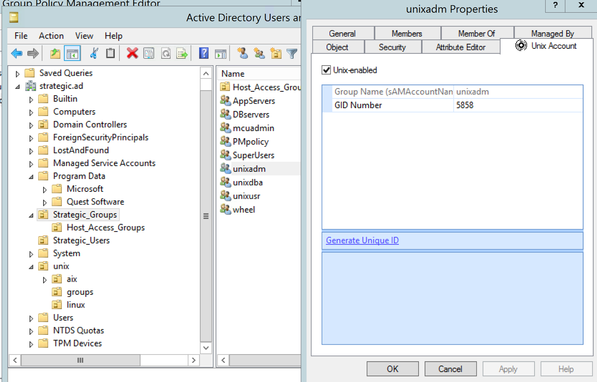
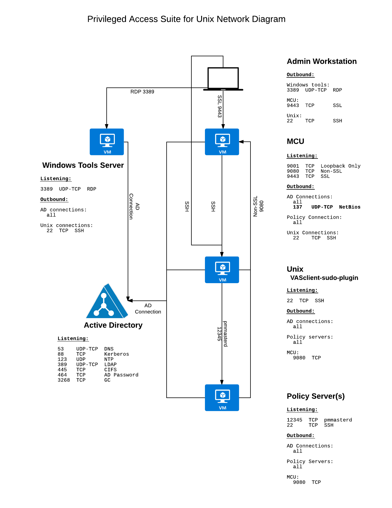

# Active Directory Requirements for PASU

This document describes the requirements for the Privileged Access Suite for Unix, by Quest, One Identity. Specifically what is required from the AD side to install and manage the tools. While installation and administration requirements are described in detail in the various product manuals, this document describes the requirements for all of the products in the PASU suite in one place.

Privileged Access Suite is a bundle of software that includes the following:

- Authentication Services (VAS)
 - Bridge AD users and management to Unix
 - Authentication
 - Group Policy
- Privilege Manager for sudo (PMsudo)
 - Centralized management of sudoers policy
 - Centralized Logging
 - Automatic encryption
 - Keystroke and Session Recording
- Management Console for Unix (MCU)
 - Java based Unix administration tool
 - Installs and Configures agents
 - Real-time reporting of Unix access and privileges

## Table of Contents

- [Active Directory Requirements for PASU](#active-directory-requirements-for-pasu)
 - [Table of Contents](#table-of-contents)
- [Project Contacts](#project-contacts)
- [Windows Installation Requirements](#windows-installation-requirements)
	- [Host Specifications](#host-specifications)
	- [Prerequisite Windows Software](#prerequisite-windows-software)
	- [Windows Components](#windows-components)
	- [Windows Permissions](#windows-permissions)
	- [Schema Optimization](#schema-optimization)
	- [Display Specifier Registration](#display-specifier-registration)
	- [Configure Active Directory](#configure-active-directory)
- [Delegated Active Directory Rights](#delegated-active-directory-rights)
	- [Join Rights](#join-rights)
	- [Unix enable User](#unix-enable-user)
	- [Unix Enabled Group](#unix-enabled-group)
	- [Modify Group Membership](#modify-group-membership)
	- [Efficient Application of Group Policy](#efficient-application-of-group-policy)
	- [Modify Group Policy](#modify-group-policy)
- [Appendix A - Rights to Join](#appendix-a-rights-to-join)
- [Appendix B – User, Group Rights](#appendix-b-user-group-rights)
- [Appendix C – Authentication Services Permissions Matrix](#appendix-cauthentication-services-permissions-matrix)
- [Appendix D – Network and Firewall Port Diagram](#appendix-d-network-and-firewall-port-diagram)

## Windows Installation Requirements
#### Host Specifications
The VAS Windows Management tools can be installed on virtually any type Windows host including workstations and servers. However, due to the frequency of updates, it is suggested they be installed on a central server class host with shared administrative access over RDP.

**Windows Server 2008-2012r2**
*  2 Cores
*  8GB RAM
*  50GB Disk
*  Domain Joined

#### Prerequisite Windows Software
If any of the prerequisites are missing, the installer suspends the process to allow you to download the required components, then continues.

*  Windows Installer 3.1
 * http://support.microsoft.com/kb/893803
* Microsoft .NET Framework 3.5 SP1 or higher
* Windows PowerShell 1.0 or higher
 * http://support.microsoft.com/kb/968929

#### Windows Components
The following Windows Features must be installed prior to installing the VAS Windows tools:

* Remote Server Administration Tools (RSAT)
 * AD DS Tools
  * Active Directory Users & Computers
* Group Policy Management

#### Java (JRE, JDK)
Unfortunately, the Management Console (MCU), doesn't function well with the latest versions of Java. This includes the JRE version running in the Windows browser as well as the server service running on the Linux host.

The following versions are known to work:
* Windows
 * JRE 7U21 (jre-7u21-windows-x64.exe)
* Linux host
 * JDK 6U33 (jdk-6u33-linux-x64-rpm.bin)

#### Windows Permissions
To install Authentication Services on Windows, you must have:
* Local Administrator Rights
* Rights to create and delete all child objects in the container where we install the configuration settings
 * First Time Install Only
 * See [Configure Active Directory](#configure-active-directory)

**Required Permission Table**

| Rights Required | For User | Object Class | Attributes |
| --------------- | :------- | :------------ | :---------- |
| Create Child Object | VAS Admins Only | Container | |
| Delete Child Object | VAS Admins Only | Container | |
| Modify Child Object | VAS Admins Only | Container | |
| Write Attribute | VAS Admins Only | Container | *cn, displayName, description, showInAdvancedViewOnly* |
|Read Attribute | VAS Admins Only | Container | *cn, displayName, description, whenCreated* |

The table above should be applied to the AD Container described in the [Configure Active Directory](#configure-active-directory) section of this document.

#### Schema Optimization
Optimizing the schema for VAS should be performed once for the domain. Put simply, it indexes the Unix attributes used by VAS users and groups in the AD Global Catalog.

*This requires **“Schema Admin”** level rights to perform.*

It is worth repeating that while this requires Schema admin rights, it will not change or extend the schema in ANY way. It **just** indexes the POSIX Unix attributes in the Global Catalog.

More Details can be found in on the One Identity Support Site [KB67051](https://support.oneidentity.com/authentication-services/kb/67051)

#### Display Specifier Registration
Display specifiers are AD objects which provide information about how other objects display in client applications, like ADUC. Display specifiers must be registered in order for the VAS MMC snap-in to ADUC to behave properly when using the *Find* dialog.

*To register the display specifiers for VAS requires Enterprise Administrator level rights*
More Details can be found on the One Identity Support Site [KB15940](https://support.oneidentity.com/authentication-services/kb/15940)

The KB article above references the actual script that will be executed.

<a name="ConfigureAD"/>
#### Configure Active Directory
For optimal performance, Authentication Services requires an “application configuration” container which is created the first-time VAS is installed in an Active Directory domain. The container is used to store attribute mappings, user settings, the license file, etc.

The application configuration information is stored inside a container object with the specific naming of:
```script
cn={786E0064-A470-46B9-83FB-C7539C9FA27C}
```

The default location for this container is:
```script
cn=Program Data,cn=Quest Software,cn=Authentication Services,dc=<your domain>
```
This location is configurable.

## Delegated Active Directory Rights
Additional rights should be delegated to those accounts or people who will be performing various management functions.

#### Join Rights
In order for AD users to authenticate on Unix hosts running the VAS agent, the host will have to establish trust with the AD Kerberos Realm. This is accomplished by joining a computer to the domain. AD administrators must have “join” permissions assigned in order for the process to complete.

* See [Appendix A](#appendix-a-rights-to-joinA) for specific required permissions
* Enter Admin password
* Keytab for “joiner” service account for unattended, scripted joins

#### Unix enable User
In order for a user to successfully authenticate to a Unix host which has been joined to the domain, their AD account must be “Unix enabled” first. This is easiest accomplished with the VAS MMC snap-in to the AD Users & Computers tool.


A “Unix enabled” AD user will have the following attributes populated:
```script
uidNumber
gidNumber
gecos
unixHomeDirectory
loginShell
```
See [Appendix B](#AppendixB) for specific required permissions

Groups for the following roles should be considered for delegation.

* Import existing Unix users
 * “Unix enable” existing users
  * Update POSIX attributes in AD
* Import Existing Unix groups
 * Create “unix enabled” groups
 * Populate group members

#### Unix Enabled Group
Similar to Users, Active Directory groups must be “Unix enabled” in order to be used for file and directory ownership rights on Unix clients. This is easiest accomplished with the VAS MMC snap-in to the AD Users & Computers tool.

A “Unix enabled” group will have a GID number assigned to the gidNumber attribute of a normal AD security group.
```
gidNumber
```


#### Modify Group Membership
If Unix groups are stored in AD, they must be managed there as well. Rights to modify “Unix enabled” AD groups should be appropriately delegated to those responsible for managing Unix group membership.

#### Efficient Application of Group Policy
Active Directory’s OU structure can be organized to most efficiently provide for the correct application of user access to the appropriate hosts with appropriate privileges delegated. Organize Unix computer objects into dedicated areas of the existing JDA OU structure.

Example:
```script
YourDomain.AD
 => UnixServers
    => AIX_Servers     # Computer Objects
    => Linux_Servers   # Computer Objects
    => Unix_Groups     # Unix Groups
    => Host_Groups     # Host Role and Access Groups
      => DBservers     # AD Group of Computer Objects
      => APPserverX    # Access to APPserverX servers
```

#### Modify Group Policy
Authentication Services utilizes Microsoft Group policy to assign configuration settings to Unix hosts running the VAS agent.

Group policies will be created and linked to the “Unix OU” and to the Linux and AIX sub-OUs. Other Group Policies will be linked to the “Unix OU” but ultimately filtered so they apply to Unix systems based on the host role group.

Unix administrators should be delegated the right to modify GPOs created for managing Unix hosts.

## Appendix A - Rights to Join
Reference [KB128214](https://support.oneidentity.com/authentication-services/kb/128214)

If the computer object does not already exist:
* Create Computer Object right for the specific domain or OU

If the computer object already exists the following permissions are required:
* Object permissions
 * Reset Password
* Object Properties
 * Write DNS Host Name Attributes
 * Write userAccountControl
 * Write servicePrincipalName
* Suggested, but technically optional properties
 * Write Operating System
 * Write Operating System Version
 * Write userPrincipalName

## Appendix B – User, Group Rights
Administrators who will be “Unix enabling” AD users will require the right to modify the User object POSIX “Unix” attributes.
```
uidNumber
gidNumber
gecos
unixHomeDirectory
loginShell
```
Groups:
```
gidNumber
```

Specific instructions for delegating AD rights can be found in [KB22967](https://support.oneidentity.com/authentication-services/kb/22967)

## Appendix C - Authentication Services Permissions Matrix
One Identity provides a nice list of commands or tasks and the permissions associated with each in the [Permissions Matrix](https://support.oneidentity.com/technical-documents/authentication-services/4.1/installation-guide/3#TOPIC-727155) section of the Install Guide

## Appendix D - Network and Firewall Port Diagram


